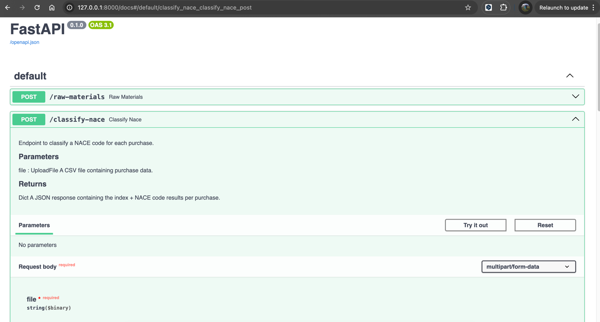

# GC NACE Classifier

Service to classify commodities under a NACE economic activity and extract the likely raw materials.

NACE is the Statistical Classification of Economic Activities in the European Community. See:
- The [official regulation](https://eur-lex.europa.eu/legal-content/EN/TXT/?uri=CELEX%3A02006R1893-20190726)  by the EU Parliamnent.
- The [official data source](https://op.europa.eu/en/web/eu-vocabularies/dataset/-/resource?uri=http://publications.europa.eu/resource/dataset/nace2) corresponding to NACE Rev 2 used by this service.

## 1. Installation

The following instructions have been tested on a UNIX (Mac) system within an Iterm shell. 
The only assumption is that python >3.7 version is available: 

1. **Pre-requisites**:
 Install and configure pyenv (for python version mgmt) and poetry: 

- Install poetry: ``pip install poetry``
- Install pyenv:``brew install pyenv``
- Add pyenv root directory to `PATH`:
  ```bash 
  echo 'export PYENV_ROOT="$HOME/.pyenv"' >> ~/.zshrc 
  echo 'export PATH="$PYENV_ROOT/bin:$PATH"' >> ~/.zshrc
  ```
- Run updated `.zshrc` config: `source ~/.zshrc` 
2. Clone the repository:
```bash
git clone git@github.com:cesarliz10/gc-nace-classifier.git
```
3. Configure python local version:
```bash
cd gc-nace-classifier
pyenv install 3.10.15
pyenv local 3.10.15
```
4. Configure poetry to use local python for virtual env:
```bash
poetry env use $(pyenv which python)
```
5. Activate the virtual environmet and install package dependencies
```bash
poetry shell
poetry install
```

## 2. API Description 

### Endpoints

This service expose an API with two endpoints for the main tasks:  

- **Classify NACE Codes**: `/classify-nace`
- **Infer Raw Materials**: `/raw-materials`

Both are `POST` methods that take a CSV file with row-based purchase data.

### Data source for NACE Classification

The classification of NACE codes is based on semantic similarity against a knowledge 
vector store. It is automatically built when the application starts, using
the file `data/nace_table.csv` as source.  Check the file existence before launching the app.


## 3. Usage instructions

Within an activated (poetry) environment, follow these steps:

1. Launch the application:
```bash
uvicorn gc_nace_classifier.main:app
```
- Take the URL where the application is running. It should be printed on a message like:

    `INFO:     Uvicorn running on http://127.0.0.1:8000`

2. Test the API endpoints directly from the browser using the `Swagger UI` interactive documentation:
- Open the browser under `<app-url>/docs#/`. Ex: `http://127.0.0.1:8000/docs#/`
- Test the NACE Classification endpoint:



- Click on `Try it out` button and then upload a test file ((ex: anonymized_data_300.csv)
- The response body should look like:

```json
{
  "rows": [
    {
      "purchase_index": 0,
      "nace_code": "39",
      "Supplier Name": "waste management and recycling company",
      "Commodity": "recyclable waste separation, steel"
    },
    {
      "purchase_index": 1,
      "nace_code": "14.12",
      "Supplier Name": "workwear and personal protective equipment company",
      "Commodity": "work clothes"
    },
    ...
    }
```

3. (Optional) Curl requests:

- On a different terminal session, make a request to the `classify-nace` endpoint:
```bash
curl -X POST "http://127.0.0.1:8000/classify-nace" \
     -H "accept: application/json" \
     -H "Content-Type: multipart/form-data" \
     -F "file=@<absolute-project-path>/gc-nace-classifier/data/<input-file>.csv"
```
- `<absolute-project-path>` is the placeholder for the absolute path to the repo.
- `<input-file>` is the placeholder for the name of the input csv to be used (ex: anonymized_data_300.csv).

## 3. Project structure

```
gc-nace-classifier/
│
├── gc_nace_classifier/
│   ├── __init__.py
│   ├── main.py               # FastAPI entry point
│   ├── models.py             # Pydantic models
│   ├── preprocess.py         # Data preprocessing
│   ├── classify.py           # NACE Classification
│   ├── material.py           # Raw material extraction
│   ├── utils.py              # Utilities
│   ├── rag/                  # Directory for RAG logic
│   │   ├── __init__.py
│   │   ├── vector_store.py   # Vector store for NACE code
│   │   ├── nace_source.csv   # Data source for NACE codes
│
├── tests/  # ToDo
│
├── .python-version
├── poetry.lock
├── pyproject.toml
├── README.md                 # Documentation
└── data/                     # Sample .csv data

```